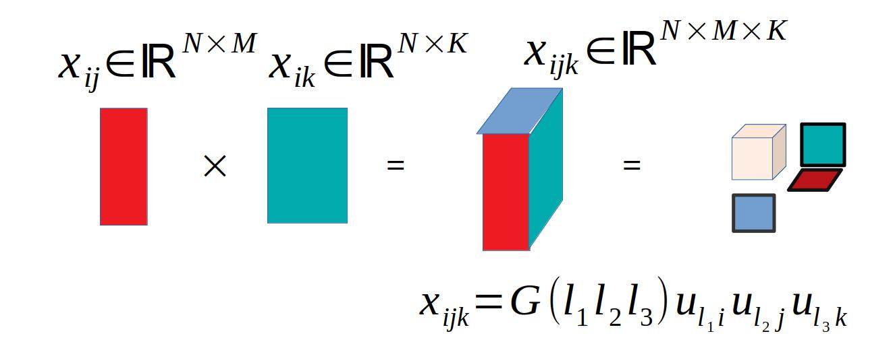
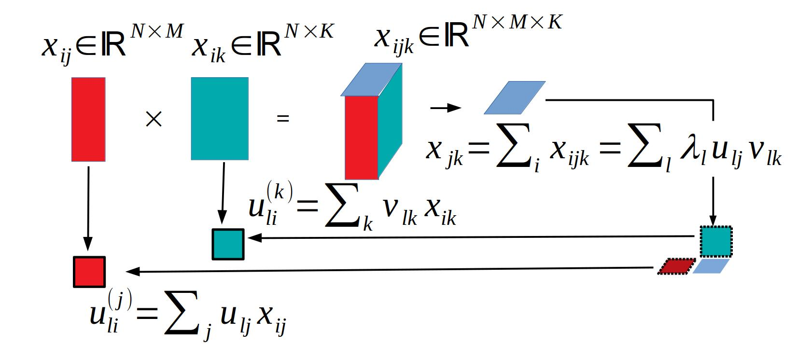
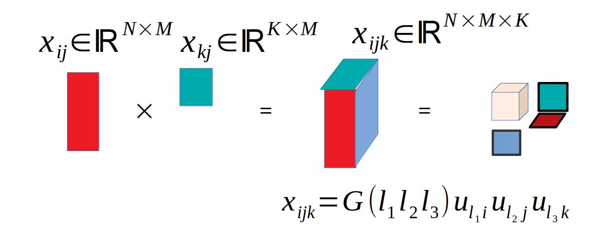
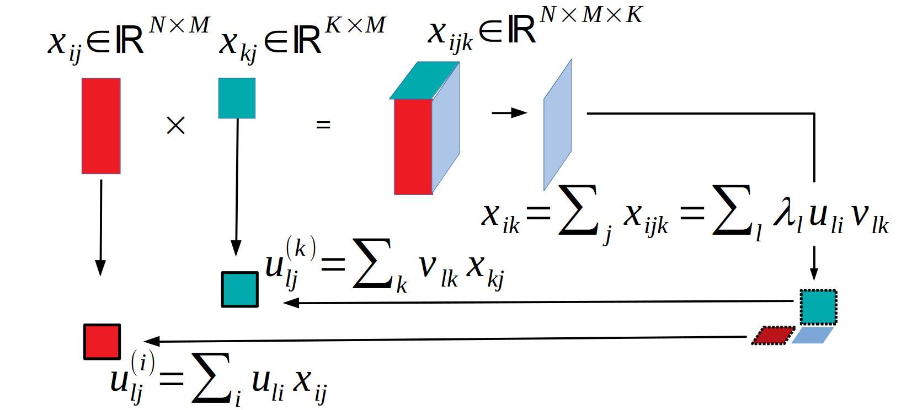
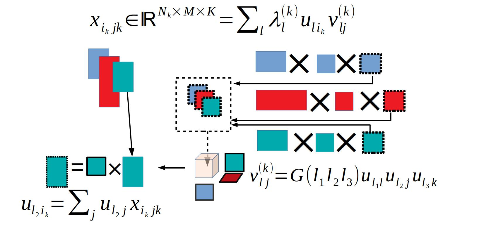
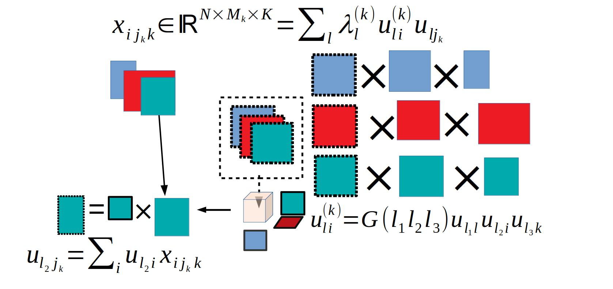

```{r style, echo = FALSE, results = 'asis'}
BiocStyle::markdown()
```

```{r, include = FALSE}
knitr::opts_chunk$set(
  collapse = TRUE,
  comment = "#>"
)
```

```{r setup}
#library(TDbasedUFEadv)
```

# Introduction 

Since TDbasedUFEadv is an advanced package from TDbasedUFE [@TDbasedUFE], please master the 
contents in TDbasedUFE prior to the trial of this package. 

## Motivations

Since the publication of the book [@Taguchibook] describing the methodology, 
I have published numerous papers using this method. In spite of that, very 
limited number of researcher used this method, possibly because of unfamiliarity
with the mathematical concepts used in this methodology, tensors. 
Thus I decided to develop the packages by which users can use the methods 
without detailed knowledge about the tensor. 

## What differs from related packages.

The main purpose of this package is to select features (typically genes) based 
upon provided omics data sets. In this sense, apparently the functionality of this
package is similar to [DESeq2](https://doi.org/doi:10.18129/B9.bioc.DESeq2) or [limma](https://doi.org/doi:10.18129/B9.bioc.limma), which have  functionality that can 
identify differentially expressed genes. In contrast to those supervised methods,
the present method is unsupervised one, which provides users what kind of 
profiles are observed over samples, and users are advised to select one of
favorite features by which features are selected. In addition to this, the
present method is suitable to small number of samples associated with large 
number of features. Since this situation is very common in genomics, the 
present method is supposed to be suitable to be applied to genomics, although
it does not look liked the methods very specific to genomics science. 
Actually, we have published the number of papers using the methods implemented 
in the present package. I hope that one can make use of this package for his/her
own researches. 


# Integrated analysis of two omics data sets


## When features are shared.

### Full tensor 



Suppose we have two omics profiles
$$
x_{ij} \in \mathbb{R}^{N \times M} \\
x_{ik} \in \mathbb{R}^{N \times K}
$$
that represent values of $i$th feature  of $j$th and $k$th objects, respectively 
(i.r., these two profiles share the features).
In this case, we generate a tensor, $x_{ijk}$, by the product of two profiles as
$$
x_{ijk} =  x_{ij}x_{ik} \in \mathbb{R}^{N \times M \times K}
$$

and HOSVD was applied to $x_{ijk}$ to get
$$
x_{ijk} = \sum_{\ell_1} \sum_{\ell_2} \sum_{ell_3} G(\ell_1 \ell_2 \ell_3) 
u_{\ell_1 i} u_{\ell_2 j} u_{\ell_3 k}
$$
After that we can follow the standard procedure to select features $i$s
associated with the desired properties represented by the selected singular
value vectors, $u_{\ell_2 j}$ and $u_{\ell_3 k}$, attributed to objects,
$j$s and $k$s.

### Matrix generated by partial summation 



In the above, we dealt with full tensor. It is often difficult to treat full 
tensor, since it is as large as $N \times M times K$. In this case, we can take
the alternative approach. In order that we define reduced matrix with taking 
partial summation
$$
x_{jk} = \sum_i x_{ijk}
$$
and apply SVD to $x_{jk}$ as
$$
x_{jk} = \sum_\ell \lambda_\ell u_{\ell j} v_{\ell k}
$$
and singular value vectors attributed to samples as
$$
u^{(j)}_{\ell i} = \sum_j u_{\ell j} x_{ij} \\
u^{(k)}_{\ell i} = \sum_k v_{\ell k} x_{ik}
$$
In this case, singular value vectors are attributed separately to features
associated with objects $j$ and $k$, respectively.

The feature selection can be done using these singular value vectors associated
with selected singular value vectors attributed to samples, $j$ and $k$.

## When samples are shared.

### Full tensor



In the case where not features but samples are shared between two omics data, 
we can do something similar.
$$
x_{ij} \in \mathbb{R}^{N \times M} \\
x_{kj} \in \mathbb{R}^{K \times M}
$$


In this case, we generate a tensor, $x_{ijk}$, by the product of two profiles as
$$
x_{ijk} =  x_{ij}x_{kj} \in \mathbb{R}^{N \times M \times K}
$$

and HOSVD was applied to $x_{ijk}$ to get
$$
x_{ijk} = \sum_{\ell_1} \sum_{\ell_2} \sum_{ell_3} G(\ell_1 \ell_2 \ell_3) 
u_{\ell_1 i} u_{\ell_2 j} u_{\ell_3 k}
$$
After that we can follow the standard procedure to select features $i$s and $k$s
associated with the desired properties represented by the selected singular
value vectors, $u_{\ell_2 j}$, attributed to objects, $j$s.

###  Matrix generated from partial summation



In the above, we dealt with full tensor. It is often difficult to treat full 
tensor, since it is as large as $N \times M times K$. In this case, we can take
the alternative approach. In order that we define reduced matrix with taking 
partial summation
$$
x_{ik} = \sum_j x_{ijk}
$$
and apply SVD to $x_{jk}$ as
$$
x_{ik} = \sum_\ell \lambda_\ell u_{\ell i} v_{\ell k}
$$
$i$s and $k$s are selected with $u_{\ell i}$ and $v_{\ell k}$, respectively. 
Singular value vectors attributed to samples can be computed as
$$
u^{(i)}_{\ell j} = \sum_i u_{\ell i} x_{ij} \\
u^{(k)}_{\ell j} = \sum_k v_{\ell k} x_{kj}
$$

# Integrated analysis using projection

Here we would like to propose an alternative strategy to integrate multiple 
tensors using projection with SVD.

## When samples are shared.



Suppose we have multiomics data as
$$
x_{ijk} \in \mathbb{R}^{N_k \times M \times K}
$$
for $i$th feature of $j$th sample at $k$th omics data.

In order to bundle them into a tensor, we applied SVD to them as
$$
x_{ijk} = \sum_{\ell} \lambda^{(k)}_\ell u_{\ell i_k} v^{(k)}_{\ell j}
$$

Then apply HOSVD to $v^{(k)}_{\ell j}$ as
$$
v^{(k)}_{\ell j} = \sum_{\ell_1} \sum_{\ell_2} \sum_{\ell_3} G(\ell_1 \ell_2 \ell_3)
u_{\ell_1 \ell } u_{\ell_2 j} u_{\ell_3 k}
$$
After identifying the $u_{\ell_2j}$ and $u_{\ell_3 k}$ of interest, we can compute $u_{\ell i_k}$ as
$$
u_{\ell_2 i_k} = \sum_j u_{\ell_2 j} x_{i_k j k}
$$
Then $i_k$ can be selected as usual. 

## When features are shared.



Suppose we have multiple sets of samples as
$$
x_{ij_k k} \in \mathbb{R}^{N \times M_k \times K}
$$

In order to bundle them into a tensor, we apply SVD to $x_{i j_k k}$ as
$$
x_{i j_k k} = \sum_\ell \lambda^{(k)}_\ell u^{(k)}_{\ell i} u_{\ell j_k}
$$
HOSVD is applied to $u^{(k)}_{\ell i}$ as
$$
u^{(k)}_{\ell i} = \sum_{\ell_1} \sum_{\ell_2} \sum_{\ell_3}
G(\ell_1 \ell_2 \ell_3) u_{\ell_1 \ell} u_{\ell_2 i} u_{\ell_3 k}
$$
$u_{\ell_2 j_k}$ is generated as
$$
u_{\ell_2 j_k} = \sum_i u_{\ell_2 i}x_{i j_k k}
$$

After identifying $u_{\ell_2 j_k}$s of interest, we select $i$s using $u_{\ell_2 i}$.


```{r}
sessionInfo()
```
