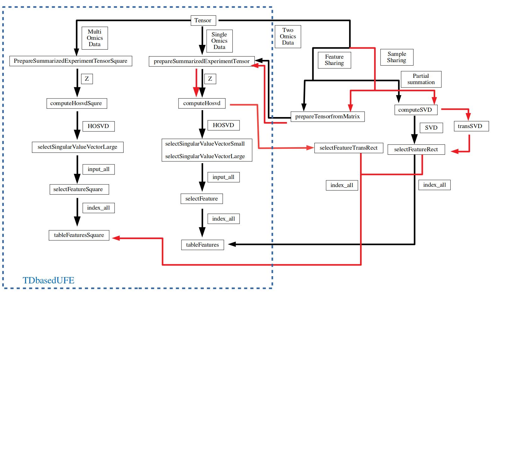
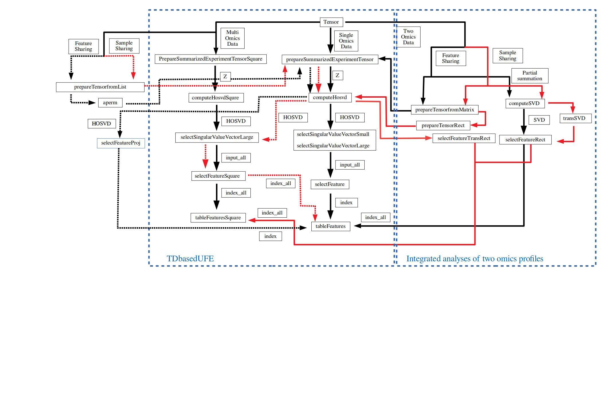

```{r style, echo = FALSE, results = 'asis'}
BiocStyle::markdown()
```

```{r, include = FALSE}
knitr::opts_chunk$set(
  collapse = TRUE,
  crop = NULL,
  comment = "#>"
)
```

```{r setup}
library(TDbasedUFEadv)
library(Biobase)
library(RTCGA.rnaseq)
library(TDbasedUFE)
library(MOFAdata)
library(TDbasedUFE)
library(RTCGA.clinical)
```
# Installation

``` {r, eval = FALSE}
if (!require("BiocManager", quietly = TRUE))
    install.packages("BiocManager")
BiocManager::install("TDbasedUFEadv")
```


# Integrated analyses of two omics profiles 


Here is a flowchart how we can make use of individual functions in 
TDbasedUFE and TDbasedUFEadv.




## When features are shared.

In order to make use of TDbasedUFE for the drug repositioning, we previously
proposed[@Taguchi2017] the integrated analysis of two gene expression profiles, 
each of which is composed of gene expression of drug treated one and disease 
one. At first, we try to prepare two omics profiles, expDrug and expDisease, 
that represent gene expression profiles of cell lines treated by various drugs
and a cell line of diseases by
``` {r}
Cancer_cell_lines <- list(ACC.rnaseq, BLCA.rnaseq, BRCA.rnaseq, CESC.rnaseq)
Drug_and_Disease <- prepareexpDrugandDisease(Cancer_cell_lines)
expDrug <- Drug_and_Disease$expDrug
expDisease <- Drug_and_Disease$expDisease
rm(Cancer_cell_lines)
```
expDrug is taken from RTCGA package and those associated with Drugs based upon 
[@Ding2016].  Those files are listed in drug_response.txt included in Clinical
drug responses at http://lifeome.net/supp/drug_response/.
expDisease is composed of files in BRCA.rnaseq, but not included in expDrug
(For more details, see source code of prepareexpDrugandDisease).
Then prepare a tensor as
```{r}
Z <- prepareTensorfromMatrix(
  exprs(expDrug[seq_len(200), seq_len(100)]),
  exprs(expDisease[seq_len(200), seq_len(100)])
)
sample <- outer(
  colnames(expDrug)[seq_len(100)],
  colnames(expDisease)[seq_len(100)], function(x, y) {
    paste(x, y)
  }
)
Z <- PrepareSummarizedExperimentTensor(
  sample = sample, feature = rownames(expDrug)[seq_len(200)], value = Z
)
```
In the above, sample are pairs of file IDs taken from expDrug and expDisease. 
Since full data cannot be treated because of memory restriction, we restricted 
the first two hundred features and the first one hundred samples, respectively 
(In the below, we will introduce how to deal with the full data sets).

Then HOSVD is applied to a tensor as
``` {r}
HOSVD <- computeHosvd(Z)
```
Here we tries to find if Cisplatin causes distinct expression  (0: cell lines
treated with drugs other than Cisplatin, 1: cell lines treated with Cisplatin)
and those between two classes (1 vs 2) of BRCA (in this case, there are no
meaning of two classes) within top one hundred samples.
``` {r}
Cond <- prepareCondDrugandDisease(expDrug)
cond <- list(NULL, Cond[, colnames = "Cisplatin"][seq_len(100)], rep(1:2, each = 50))
```
Then try to select singular value vectors attributed to objects.
When you try this vignettes, although you can do it in the interactive 
mode (see below), here we assume that you have already finished the selection. 

```{r}
input_all <- selectSingularValueVectorLarge(HOSVD,cond,input_all=c(2,9)) #Batch mode
```

In the case you prefer to select by yourself  you can execute interactive mode.
```
input_all <- selectSingularValueVectorLarge(HOSVD,cond)
```
When you can see ``Next'', ``Prev'', and ``Select'' radio buttons by which you 
can performs selection as well as histogram and standard deviation optimization
by which you can verify the success of selection interactively.


Next we select which genes' expression is altered by Cisplatin.
```{r }
index <- selectFeature(HOSVD,input_all,de=0.05)
```

You might need to specify suitable value for de which is initial value of
standard deviation. 

Then we get the following plot.


Finally, list the genes selected as those associated with distinct expression.
```{r}
head(tableFeatures(Z,index))
```
```{r}
rm(Z)
rm(HOSVD)
detach("package:RTCGA.rnaseq")
rm(SVD)
```
The described methods were frequently used
in the studies[@Taguchi2017a] [@Taguchi2018]  [@Taguchi2020] by maintainers.

### Reduction of required memory using partial summation.

In the case that  there are large number of features, it is impossible to apply
HOSVD to a full tensor (Then we have reduced the size of tensor).
In this case, we apply SVD instead of HOSVD to matrix 
generated from a tensor as follows.
In contrast to the above where only top two hundred features and top one hundred 
samples are included, the following one includes all features and all samples since
it can save required memory because partial summation of features.
``` {r}
SVD <- computeSVD(exprs(expDrug), exprs(expDisease))
Z <- t(exprs(expDrug)) %*% exprs(expDisease)
sample <- outer(
  colnames(expDrug), colnames(expDisease),
  function(x, y) {
    paste(x, y)
  }
)
Z <- PrepareSummarizedExperimentTensor(
  sample = sample,
  feature = rownames(expDrug), value = Z
)
```

Nest select singular value vectors attributed to drugs and cell lines then 
identify features associated with altered expression by treatment of
Cisplatin as well as distinction between two classes. Again, it included 
all samples for expDrug and expDisease.
``` {r}
cond <- list(NULL,Cond[,colnames="Cisplatin"],rep(1:2,each=dim(SVD$SVD$v)[1]/2))
```

Next we select singular value vectors and optimize standard deviation 
as batch mode 
```{r}
index_all <- selectFeatureRect(SVD,cond,de=c(0.01,0.01),
                               input_all=3) #batch mode
```
Again you need to select suitable de by trials and errors.

For interactive mode, one should do
```
index_all <- selectFeatureRect(SVD,cond,de=c(0.01,0.01))
```
but it is not possible in vignettes that does not allow interactive mode.


Then you can see selected features as 
```{r}
head(tableFeatures(Z,index_all[[1]]))
head(tableFeatures(Z,index_all[[2]]))
```
The upper one is  for distinct expression between cell lines treated with 
Cisplatin and other cell lines and the lower one is for distinct expression 
between two classes of BRCA cell lines.

Although they are highly coincident, not fully same ones (Row: expDrug, 
column:expDisease).
```{r}
table(index_all[[1]]$index,index_all[[2]]$index)
```

Confusion matrix of features selected between expDrug and expDisease.

The described methods were frequently used in the studies[@Taguchi2019a] by maintainers.

```{r}
rm(Z)
rm(SVD)
```

## When samples are shared 

The above procedure can be used when two omics data that shares samples must be integrated.
Prepare data set as
```{r}
data("CLL_data")
data("CLL_covariates")
```

(see vignettes QuickStart in TDbasedUFE for more details about this 
data set).
Generate tensor from matrix as in the above, but since not features but 
samples are shared between two matrices,
the resulting Z has samples as features and features as samples, respectively.
```{r}
Z <- prepareTensorfromMatrix(
  t(CLL_data$Drugs[seq_len(200), seq_len(50)]),
  t(CLL_data$Methylation[seq_len(200), seq_len(50)])
)
Z <- prepareSummarizedExperimentTensorRect(
  sample = colnames(CLL_data$Drugs)[seq_len(50)],
  feature = list(
    Drugs = rownames(CLL_data$Drugs)[seq_len(200)],
    Methylatiion = rownames(CLL_data$Methylation)[seq_len(200)]
  ),
  sampleData = list(CLL_covariates$Gender[seq_len(50)]),
  value = Z
)
```

HOSVD was applied to Z as
```{r}
HOSVD <- computeHosvd(Z)
```

```{r}
cond <- list(attr(Z,"sampleData")[[1]],NULL,NULL)
```
Condition is distinction between male and female 
(see QucikStart in TDbasedUFE package).
Then try to find singular value vectors distinct between  male and female 
in interactive mode.
```{r}
index_all <- selectFeatureTransRect(HOSVD,cond,de=c(0.01,0.01),
                                    input_all=8) #batch mode
```
In the above, selection was supposed to be performed before executing the
above, since  vignettes does not allow interactive mode.
 In actual, you need to execute it in interactive mode
```
index_all <- selectFeatureTransRect(HOSVD,cond,de=c(0.01,0.01))
```
and try to select iteratively. Selected features can be shown in the below. 

```{r}
head(tableFeaturesSquare(Z,index_all,1))
head(tableFeaturesSquare(Z,index_all,2))
```

This method was used in the studies[@Taguchi2019] by the maintainer. 

###  Reduction of required memory using partial summation.

As in the case where two omics profiles share features, in the case where two
omics data share the samples, we can also take an alternative approach where 
SVD is applied to an matrix generated from a tensor by taking partial summation.
```{r}
SVD <- computeSVD(t(CLL_data$Drugs), t(CLL_data$Methylation))
Z <- CLL_data$Drugs %*% t(CLL_data$Methylation)
sample <- colnames(CLL_data$Methylation)
Z <- prepareSummarizedExperimentTensorRect(
  sample = sample,
  feature = list(rownames(CLL_data$Drugs), rownames(CLL_data$Methylation)),
  value = array(NA, dim(Z)), sampleData = list(CLL_covariates[, 1])
)
```
Condition is also distinction between male  (m) and female (f).
```{r}
cond <- list(NULL,attr(Z,"sampleData")[[1]],attr(Z,"sampleData")[[1]])
```
In order to apply the previous function to SVD, we exchange feature singular 
value vectors with sample singular value vectors. 
```{r}
SVD <- transSVD(SVD)
```
Then try to find which sample singular value vectors should be selected and
which features are selected based upon feature singular value vectors
corresponding to selected sample feature vectors.
Although I do not intend to repeat whole process, we decided to select the 
sixth singular value vectors which are some what distinct between male 
and female. Since package does not allow us interactive mode, we place here batch mode.

```{r}
index_all <- selectFeatureRect(SVD,cond,de=c(0.5,0.5),input_all=6) #batch mode
```

In the real usage, we can activate 
selectFeatureRect in interactive mode as well.
```
index_all <- selectFeatureRect(SVD,cond,de=c(0.5,0.5))
```


Then we can list the Drugs and Methylation sites selected as being distinct 
between male and female.

```{r}
head(tableFeaturesSquare(Z,index_all,1))
head(tableFeaturesSquare(Z,index_all,2))
```


This method was used in many studies[@Taguchi2018a] [@Taguchi2020a] by maintainer. 


# Integrated analysis of multiple omics data

Here is a flowchart how we can make use of individual functions in TDbasedUFE and TDbasedUFEadv.




## When samples are shared

As an alternative approach that can integrate multiple omics that share sample, 
we propose the method that makes use of projection provided by SVD.

We prepare a tensor that is a bundle of the first ten singular value vectors 
generated by applying SVD to individual omics profiles.

```{r}
data("CLL_data")
data("CLL_covariates")
Z <- prepareTensorfromList(CLL_data, as.integer(10))
Z <- PrepareSummarizedExperimentTensor(
  feature = character("1"),
  sample = array(colnames(CLL_data$Drugs), 1), value = Z,
  sampleData = list(CLL_covariates[, 1])
)
```
Then HOSVD was applied to a tensor
```{r}
HOSVD <- computeHosvd(Z,scale=FALSE)
```
Next we select singular value vectors attributed to samples.
In order to select those distinct between male (m) and female (f),
we set conditions as
```{r}
cond <- list(NULL,attr(Z,"sampleData")[[1]],seq_len(4))
```
But here in order to include TDbasedUFEadv into package, we are forced to
execute function as batch mode as
```{r}
input_all <- selectSingularValueVectorLarge(HOSVD,
  cond,
  input_all = c(12, 1)
) # batch mode
```
Interactive more can be activated as
```
input_all <- selectSingularValueVectorLarge(HOSVD,cond)
```
Although we do not intend to repeat how to use menu in interactive mode, please 
select the 12th one and the third one. 

Finally,  we perform the following function to select features in individual 
omics profiles in an batch mode, 
since packaging does not allow interactive mode.

``` {r}
HOSVD$U[[1]] <- HOSVD$U[[2]]
index_all <- selectFeatureSquare(HOSVD, input_all, CLL_data,
  de = c(0.5, 0.1, 0.1, 1), interact = FALSE
) # Batch mode
```

In actual usage, you can activate interactive mode as
``` 
HOSVD$U[[1]] <- HOSVD$U[[2]]
index_all <- selectFeatureSquare(HOSVD, input_all, CLL_data,
  de = c(0.5, 0.1, 0.1, 1)
)
```

Finally, we list the selected features for four omics profiles that share samples.

```{r}
for (id in c(1:4))
{
  attr(Z, "feature") <- rownames(CLL_data[[id]])
  print(tableFeatures(Z, index_all[[id]]))
}
```

This method was used in many studies[@Taguchi2022] by maintainer. 


## When features are shared

Now we discuss what to do when multiple omics data share not samples but 
features. We prepare data set from RTCGA.rnaseq as follows, with retrieving 
reduced partial sets from four ones. One should notice that RTCGA is an old
package from TCGA (as for 2015). I used it only for demonstration purpose.
If you would like to use TCGA for your research, I recommend you to use
more modern packages, e.g., curatedTCGAData in Bioconductor.
```{r}
library(RTCGA.rnaseq) #it must be here, not in the first chunk
Multi <- list(
  BLCA.rnaseq[seq_len(100), 1 + seq_len(1000)],
  BRCA.rnaseq[seq_len(100), 1 + seq_len(1000)],
  CESC.rnaseq[seq_len(100), 1 + seq_len(1000)],
  COAD.rnaseq[seq_len(100), 1 + seq_len(1000)]
)
```
Multi includes four objects, each of which is matrix that represent 100 samples (rows) and 1000 (features). Please note it is different from usual cases where columns and rows are features and samples, respectively. They are marge into tensor as follows
```{r}
Z <- prepareTensorfromList(Multi,as.integer(10))
Z <- aperm(Z,c(2,1,3))
```
The function, prepareTeansorfromList which was used in the previous subsection
where samples are shared, can be used as it is. However, the first and second 
modes of a tensor must be exchanged by aperm function for the latter analyses,
because of the difference as mentioned in the above. Then tensor object 
associated with various information is generated as usual as follows and 
HOSVD was applied to it. 
``` {r}
Clinical <- list(BLCA.clinical, BRCA.clinical, CESC.clinical, COAD.clinical)
Multi_sample <- list(
  BLCA.rnaseq[seq_len(100), 1, drop = FALSE],
  BRCA.rnaseq[seq_len(100), 1, drop = FALSE],
  CESC.rnaseq[seq_len(100), 1, drop = FALSE],
  COAD.rnaseq[seq_len(100), 1, drop = FALSE]
)
# patient.stage_event.tnm_categories.pathologic_categories.pathologic_m
ID_column_of_Multi_sample <- c(770, 1482, 773, 791)
# patient.bcr_patient_barcode
ID_column_of_Clinical <- c(20, 20, 12, 14)
Z <- PrepareSummarizedExperimentTensor(
  feature = colnames(ACC.rnaseq)[1 + seq_len(1000)],
  sample = array("", 1), value = Z,
  sampleData = prepareCondTCGA(
    Multi_sample, Clinical,
    ID_column_of_Multi_sample, ID_column_of_Clinical
  )
)
HOSVD <- computeHosvd(Z)
```
In order to see which singular value vectors attributed to samples are used for the selection of singular value vectors attributed to features, we need to assign sample conditions.
```{r}
cond<- attr(Z,"sampleData")
```

Since package does not allow us to include interactive mode, we place here batch mode as follows.
Finally, selected feature are listed as follows.
``` {r}
index <- selectFeatureProj(HOSVD,Multi,cond,de=1e-3,input_all=3) #Batch mode
head(tableFeatures(Z,index))
```
In actual, you can activate interactive mode as 

```
par(mai=c(0.3,0.2,0.2,0.2))
index <- selectFeatureProj(HOSVD,Multi,cond,de=1e-3)
```
Although we do not intend to explain how to use menu interactively, 
we select the third singular value vectors as shown in above.

This method was used in many studies[@Taguchi2021] by maintainer. 


```{r}
sessionInfo()
```