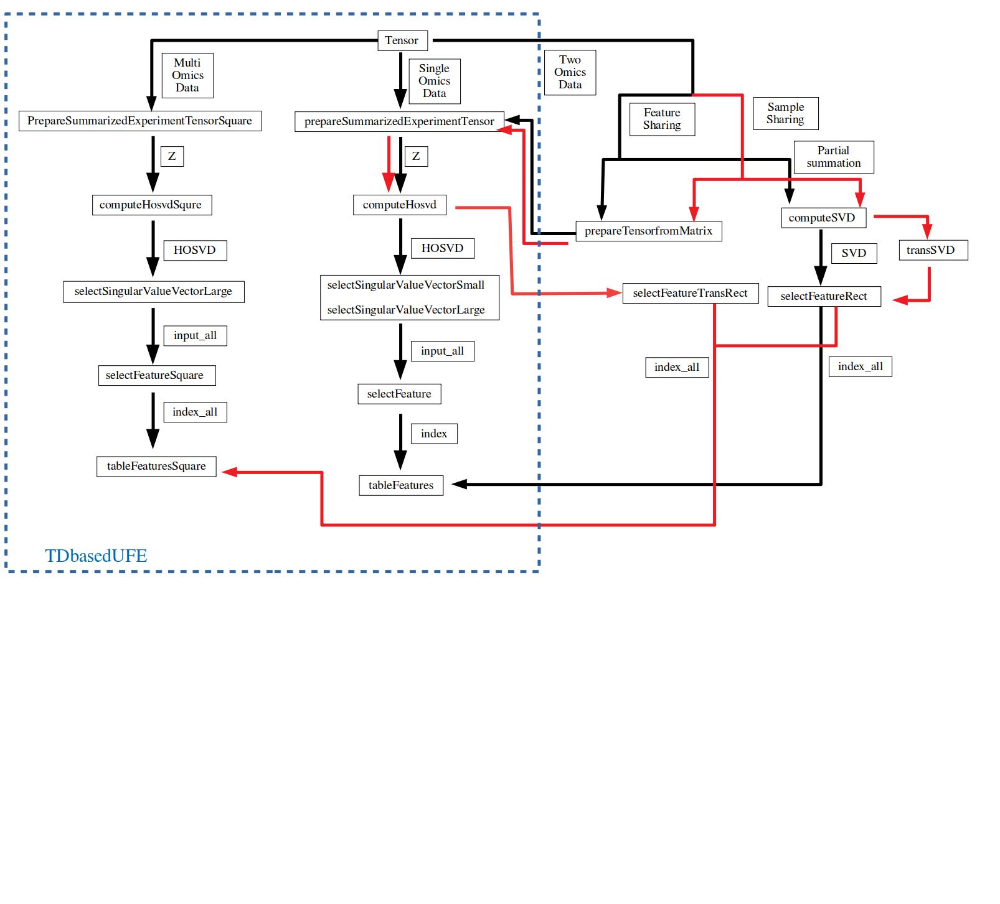

```{r style, echo = FALSE, results = 'asis'}
BiocStyle::markdown()
```

```{r, include = FALSE}
knitr::opts_chunk$set(
  collapse = TRUE,
  comment = "#>"
)
```

```{r setup}
library(TDbasedUFEadv)
```
# Introduction
Since TDbasedUFEadv is an advanced package from TDbasedUFE, please master the
contents in TDbasedUFE prior to the trial of this package. Here is a flowchart 
how we can make ues of indvidual funcions in TDbassedUFE and TDbasedUFEadv.



# Integrated anayses of two omics profiles 

## When features are shared.

In order to make use of TDbasedUFE for the drug riposiooning, we previously
proposed[@Taguchi2017] the intergated analysis of two gene expression profiles, 
each of which is composed of gene expression of drug treated one and disease 
one. At first, we try to prepare two omics profiles, expDrug and expDisease, 
that represent gene expression profiles of cell lines treated by various drugs
and a cell line of diseas by
``` {r}
require(RTCGA.rnaseq)
 LIST <- list(ACC.rnaseq,
                 BLCA.rnaseq,
                 BRCA.rnaseq,
                 CESC.rnaseq,
                 COAD.rnaseq,
                 ESCA.rnaseq,
                 GBM.rnaseq,
                 HNSC.rnaseq,
                 KICH.rnaseq,
                 KIRC.rnaseq,
                 KIRP.rnaseq,
                 LGG.rnaseq,
                 LIHC.rnaseq,
                 LUAD.rnaseq,
                 LUSC.rnaseq,
                  OV.rnaseq,
                 PAAD.rnaseq,
                 PCPG.rnaseq,
                 PRAD.rnaseq,
                 READ.rnaseq,
                 SARC.rnaseq,
                 SKCM.rnaseq,
                 STAD.rnaseq,
                 TGCT.rnaseq,
                 THCA.rnaseq,
                 UCEC.rnaseq,
                 UCS.rnaseq)
dummy <- prepareexpDrugandDisease(LIST)
expDrug <- dummy[[1]]
expDisease <- dummy[[2]]
rm(LIST)
```
expDrug is taken from RTCGA packge and those associated with Drugs based upon 
[@Ding2016].  Those files are listed in drug_response.txt included in Clinical
drug responses at http://lifeome.net/supp/drug_response/.
expDisease is composed of files in BRCA.rnaseq, but not included in expDrug
(For more details, see source code of prepareexpDrugandDisease).
Then prepare a tensor as
```{r}
require(Biobase)
Z <- prepareTensorfromMatrix(exprs(expDrug[seq_len(200),seq_len(100)]),
                             exprs(expDisease[seq_len(200),seq_len(100)]))
sample<- outer(colnames(expDrug)[seq_len(100)],
               colnames(expDisease)[seq_len(100)],function(x,y){paste(x,y)})
require(TDbasedUFE)
Z <- PrepareSummarizedExperimentTensor(
    sample=sample,feature=rownames(expDrug)[seq_len(200)],value=Z)
```
In the above, sample are pairs of file IDs taken from expDrug and expDisease. 
Since full data cannot be treated because of memory ristriction, we ristricted 
the first two hundred features and the first one hundred samples, respectively 
(In the below, we will introduce how to deal with the full datasets).

Then HOSVD is applied to a tensor as
``` {r}
HOSVD <- computeHosvd(Z)
```
Here we tries to find if Cisplatin causes distinct expression  (0: cell lines
treated with drugs otherthan Cisplatin, 1: cell lines treated with Cisplatin)
and those between two classes (1 vs 2) of BRCA (in this case, there are no
meaning of two classes) within top one hudrder samples.
``` {r}
Cond <- prepareCondDrugandDisease(expDrug)
cond <- list(NULL,Cond[,colnames="Cisplatin"][seq_len(100)],rep(1:2,each=50))
```
Then try to select singular value vectors attributed to objects.
When you try this vignettes, you can do it interactive mode as
```
input_all <- selectSingularValueVectorLarge(HOSVD,cond)
```
Then we can see the following plot


and a menu
```
1: NEXT
2: PREV
3: SELCT
```
It represents a distinction between cell lines treated with Cisplatin (1) and
others (0). Since these are not associated with clear distinction, we need to
see next singular value vector. Then type 1 and press enter. Then we get 
this plot


and menu
```
1: NEXT
2: PREV
3: SELCT
```
Since this one is somewhat distinct between 0 (cell lines treatedwith drugs
other than Cisplatin) and 1 (those treated with Cisplatin), we decide to 
select this one. Then type 3 and press enter.

Then we can see the following plot 


and  a menu

```
1: NEXT
2: PREV
3: SELCT
```

This represent a distinction between two classes of BRCA cell lines (1 vs 2). 
Since this one does not represent distinction we continue to type 1 and press 
enter unril we can see the nineth one as


Since this one represents the distinction, we decied to select this one and
type 3 and press enter in the following menu.

```

1: NEXT
2: PREV
3: SELCT
```

In order to place this vignettes in Bioconductor that does not allow
interactive input we write this function as
```{r, fig.keep = "none"}
input_all <- selectSingularValueVectorLarge(HOSVD,cond,input_all=c(2,9)) #Batch mode
```
that works in batch mode.

Next we select which genes' expression is altered by Cisplatin.
```{r, fig.keep = "none"}
index <- selectFeature(HOSVD,input_all,de=0.05)
```

You might need to specify suitable value for de which is initial value of
standard deviation. 

Then we get the following plot.


Finally, list the genes selected as those associated with distinct expression.
```{r}
head(tableFeatures(Z,index))
```
```{r}
rm(Z)
rm(HOSVD)
detach("package:RTCGA.rnaseq")
```
The described methods were freeuently used in the studies[@Taguchi2017a] [@Taguchi2018]  [@Taguchi2020] by maintenors.

### Reduction of required memory using partial summation.

In the case that  there are large number of features, it is impossible to apply
HOSVD to a full tensor (Then we have reduced the saie of tensor).
In this case, we apply SVD instead of HOSVD to matrix 
generated from a tensor as follows.
In contrast to the above where only top two hudred features and top one hundred 
samples are included, the following one includes all features and all samples since
it can save required memory because partial summation of features.
``` {r}
library(Biobase)
SVD <- computeSVD(exprs(expDrug),exprs(expDisease))
Z <- t(exprs(expDrug)) %*% exprs(expDisease)
sample<- outer(colnames(expDrug),colnames(expDisease),
               function(x,y){paste(x,y)})
Z <- PrepareSummarizedExperimentTensor(sample=sample,
            feature=rownames(expDrug),value=Z)
```

Nest select sigular value vectors attributed to drugs and cell lines then 
identify features associated with altered expression by treatment of
Cisplatin as well as ditinction etween two classes. Again, it included 
all samples for expDrug and expDisease.
``` {r}
cond <- list(NULL,Cond[,colnames="Cisplatin"],rep(1:2,each=dim(SVD$SVD$v)[1]/2))
```
For interactive mode, one should do
```
index_all <- selectFeatureRect(SVD,cond,de=c(0.01,0.01))
```
Again you need to select suitable de by trials and errors.

Here we don't repeat whole processes, but please show the third one


and type 3 to select this one and press enter.

Then we can see the plot


Press enter again to forward and we can see 


then press enter to finialze the feature selection.

Since Bioconductor does not allow interactive mode,  in this vignettes, 
we place the following.
```{r, fig.keep="none"}
index_all <- selectFeatureRect(SVD,cond,de=c(0.01,0.01),
                               input_all=3) #batch mode
```
Then you can see selected features as 
```{r}
head(tableFeatures(Z,index_all[[1]]))
head(tableFeatures(Z,index_all[[2]]))
```
The upper one is  for ditinct expression between cell lines treated with 
Cisplatin and other cell lines and the lower one is for ditinct expression 
between two classes of BRCA cell lines.

Although they are highly coincident, not fully same ones (Row: expDrug, 
columen:expDisease).
```{r}
table(index_all[[1]]$index,index_all[[2]]$index)
```

Confusion matrix of features selceted between expDrug and expDisease.

The described methods were freeuently used in the studies[@Taguchi2019a] by maintenors.


## When samples are shared 

The above procedure can be used when two omics data that shares samples must be integrated.
Prepare data set as
```{r}
require(MOFAdata)
data("CLL_data")
data("CLL_covariates")
```

(see vignettes QuickStart in TDbasedUFE for more details about this 
data set).
Generate tensor from matrix as in the above, but since not features but 
samples are saured between two matrices,
the resulting Z has samples as features and features as samples, respectively.
```{r}
Z <- prepareTensorfromMatrix(t(CLL_data$Drugs[seq_len(200),seq_len(50)]),
t(CLL_data$Methylation[seq_len(200),seq_len(50)]))
require(TDbasedUFE)
Z <- PrepareSummarizedExperimentTensorRect(
    sample=colnames(CLL_data$Drugs)[seq_len(50)],
    feature=list(Drugs=rownames(CLL_data$Drugs)[seq_len(200)],
                 Methylatiion=rownames(CLL_data$Methylation)[seq_len(200)]),
    sampleData=list(CLL_covariates[,1][seq_len(50)]),
    value=Z)
```

HOSVD was applied to Z as
```{r}
HOSVD <- computeHosvd(Z)
```

```{r}
cond <- list(attr(Z,"sampleData")[[1]],NULL,NULL)
```
Condition is distinction between male and female 
(see QucikStart in TDbasedUFE package).
Then try to find singular value vectors distict between  male and female 
in interactive mode.
```
index_all <- selectFeatureTransRect(HOSVD,cond,de=c(0.01,0.01))
```
Although we do not repeat the process, please select the eighth one as shown below


Since package does not allow interactive mode, we place here batch 
mode as follows.
```{r, fig.keep="none"}
index_all <- selectFeatureTransRect(HOSVD,cond,de=c(0.01,0.01),
                                    input_all=8) #batch mode
```
```{r}
head(tableFeaturesSquare(Z,index_all,1))
head(tableFeaturesSquare(Z,index_all,2))
```

This method was used in the studies[@Taguchi2019] by the maintainer. 

###  Reduction of required memory using partial summation.

As in the case where two omics profiles share features, in the case where two
omics data share the samples, we can also take an alternative approach where 
SVD is appied to an matrix generated from a tensor by taking partial summation.
```{r}
SVD <- computeSVD(t(CLL_data$Drugs),t(CLL_data$Methylation))
Z <-CLL_data$Drugs %*%t(CLL_data$Methylation)
sample<- colnames(CLL_data$Methylation)
Z <- PrepareSummarizedExperimentTensorRect(sample=sample,
    feature=list(rownames(CLL_data$Drugs),rownames(CLL_data$Methylation)),
    value=array(NA,dim(Z)),sampleData=list(CLL_covariates[,1]))
```
Condition is also distinction between male  (m) and female (f).
```{r}
cond <- list(NULL,attr(Z,"sampleData")[[1]],attr(Z,"sampleData")[[1]])
```
In order to apply the previous function to SVD, we exchange feature singular 
value vectors with sample singular value vectors. 
```{r}
SVD <- transSVD(SVD)
```
Then try to find which sample singular value vectors should be selected and
which features are selected based upon feature singular value vetors
corresponding to selected sample feature vectors. We can activate 
selectFeatureRect in interactive mode as well.
```
index_all <- selectFeatureRect(SVD,cond,de=c(0.5,0.5))
```
Although I do not intend to repeat whole process, we decided to select the 
sixith singular value vectors which are some what distinct between male 
and female.


Pressing enter we can get these two plots as well.


Since package does not allow us interactive mode, we place here bacth mode.
```{r, fig.keep='none'}
index_all <- selectFeatureRect(SVD,cond,de=c(0.5,0.5),input_all=6) #batch mode
```
Then we can list the Drugs and Methylation sites selected as being distinct 
between male and female.

```{r}
head(tableFeaturesSquare(Z,index_all,1))
head(tableFeaturesSquare(Z,index_all,2))
```

This method was used in many studies[@Taguchi2018a] [@Taguchi2020a] by maintainer. 

```{r}
sessionInfo()
```