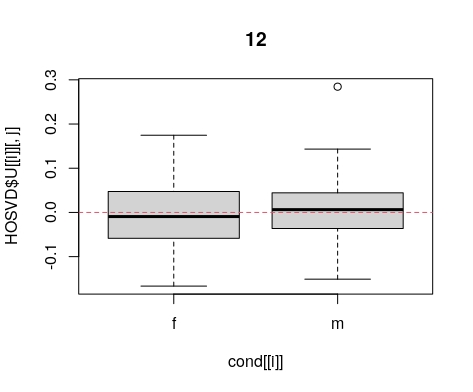
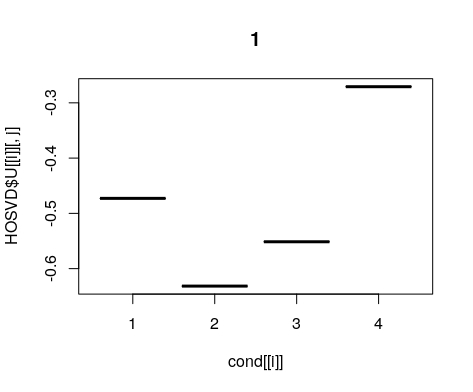
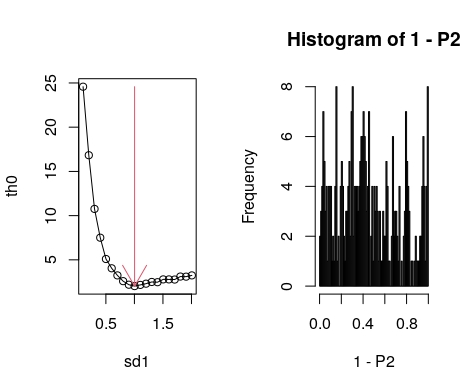
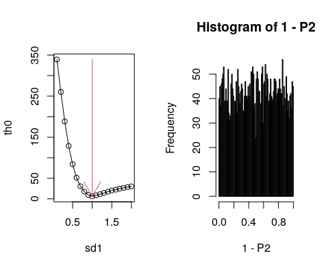
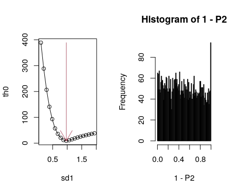
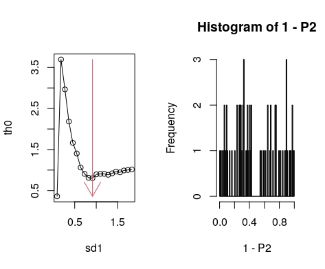
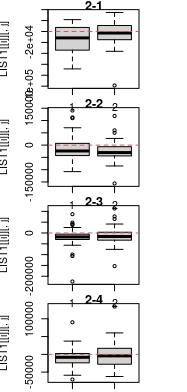
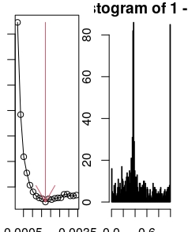

```{r style, echo = FALSE, results = 'asis'}
BiocStyle::markdown()
```

```{r, include = FALSE}
knitr::opts_chunk$set(
  collapse = TRUE,
  comment = "#>"
)
```

```{r setup}
library(TDbasedUFEadv)
library(TDbasedUFE)
```
# Introduction

Since TDbasedUFEadv is an advanced package from TDbasedUFE, please master the
contents in TDbasedUFE prior to the trial of this package. And this is the second QuickStart.
Please master Quickstart before trying this one, QuickStart2. Here is a flowchart 
how we can make ues of indvidual funcions in TDbassedUFE and TDbasedUFEadv.


# Integrated analysis of multiple omics data

## When samples are shared

As an alternative approch that can integrate multiple omics that share sample, 
we propose the method that makes use of projection provided by SVD.

We prepare a tensor that is a bundle of the first ten singular value vectors 
generated by applying SVD to individual omics profiles.

```{r}
require(MOFAdata)
data("CLL_data")
data("CLL_covariates")
Z <- prepareTensorfromList(CLL_data,10)
Z <- PrepareSummarizedExperimentTensor(feature = character("1"),
    sample=array(colnames(CLL_data$Drugs),1),value=Z,
    sampleData=list(CLL_covariates[,1]))
```
Then HOSVD was applied to a tensor
```{r}
HOSVD <- computeHosvd(Z,scale=FALSE)
```
Next we select singular value vectors attributed to samples.
In order to select those distinct between male (m) and female (f),
we set conditions as
```{r}
cond <- list(NULL,attr(Z,"sampleData")[[1]],seq_len(4))
```
Interacitve more can be activated as
```
input_all <- selectSingularValueVectorLarge(HOSVD,cond)
```

Although we do not intend to repeat how to use menu in interactive mode, please 
select the 12th one and the third one shown in below. 




But here in order to include TDbasedUFEadv into package, we are forced to
execute function as bacth mode as
```{r}
input_all <- selectSingularValueVectorLarge(HOSVD,cond,input_all=c(12,1))
```
Finally,  we perform the following function to select features in individual 
omics profiles in an interative mode
```
HOSVD$U[[1]] <- HOSVD$U[[2]] #selectFeatureSquareのHOSVD$U[[1]]を[[2]]にすればこれは不要
index_all <- selectFeatureSquare(HOSVD,input_all,CLL_data,
                                 de=c(0.5,0.1,0.1,1))
```
and we can see the following four plots (to proceed in an interctrive mode, simply press enter).





But packaging does not allow interactive mode, we place batch mode in this vignettes.

``` {r, fig.keep="none"}
HOSVD$U[[1]] <- HOSVD$U[[2]] #selectFeatureSquareのHOSVD$U[[1]]を[[2]]にすればこれは不要
index_all <- selectFeatureSquare(HOSVD,input_all,CLL_data,
                                 de=c(0.5,0.1,0.1,1),interact=FALSE) #Batch mode
```
Finnally, we list the selected features for four omics profiles that share samples.

```{r}
for (id in c(1:4))
{
    attr(Z,"feature") <- rownames(CLL_data[[id]])
    print(tableFeatures(Z,index_all[[id]]))
}
```

This method was used in many studies[@Taguchi2022] by maintainer. 


## When features are shared

Now we discuss what to do when multiple omics data share not samples but features.
We prepare data set from RTCGA.rnaseq as follows, with retriieving reduced pertial sets from four ones.
```{r}
require(RTCGA.rnaseq)
Multi <- list(BLCA.rnaseq[seq_len(100),1+seq_len(1000)],
              BRCA.rnaseq[seq_len(100),1+seq_len(1000)],
              CESC.rnaseq[seq_len(100),1+seq_len(1000)],
              COAD.rnaseq[seq_len(100),1+seq_len(1000)])
```
Multi includes four objects, each of which is matrix that represent 100 samples (rows) and 1000 (featuers). Please note it is different from usual cases where columns and rows are features and samples, respectrively. They are marged into tensor as follows
```{r}
Z <- prepareTensorfromList(Multi,10)
Z <- aperm(Z,c(2,1,3))
```
The function, prepareTeansorfromList which was used in the previous subsection where samples are shared, can be used as it is. However, the first and second modes of a tensor must be exchanged by aperm function for the latter analyses, because of the difference as mentioned in the above. Then tensor object associated with various information is generated as usual as follows and HOSVD was applied to it. 
``` {r}
require(RTCGA.clinical)
Clinical <- list(BLCA.clinical,BRCA.clinical,CESC.clinical,COAD.clinical)
Multi_sample <- list(BLCA.rnaseq[seq_len(100),1,drop=F],
              BRCA.rnaseq[seq_len(100),1,drop=F],
              CESC.rnaseq[seq_len(100),1,drop=F],
              COAD.rnaseq[seq_len(100),1,drop=F])
#patient.stage_event.tnm_categories.pathologic_categories.pathologic_m
k <- c(770,1482,773,791)
#patient.bcr_patient_barcode
j <- c(20,20,12,14)
Z <- PrepareSummarizedExperimentTensor(
    feature =colnames(ACC.rnaseq)[1+seq_len(1000)],
    sample=array("",1),value=Z,
    sampleData=prepareCondTCGA(Multi_sample,Clinical,k,j))
HOSVD <- computeHosvd(Z)
```
In order to see which singular value vectors attributed to samples are used for the selection of singular value vectors attributed to features, we need to assign sample conditions.
```{r}
cond<- attr(Z,"sampleData")
```
Then perform this 
```
par(mai=c(0.3,0.2,0.2,0.2))
index <- selectFeatureProj(HOSVD,Multi,cond,de=1e-3)
```
Although we do not intend to explain how to use menu interactively, 
we select the third singular value vectors as shown in below


and we get the following plot, too.


Since package does not allow us to include inteartive mode, we place here batch mode as follows.
Finally, selected feature are listed as follows.
``` {r, fig.keep="none"}
index <- selectFeatureProj(HOSVD,Multi,cond,de=1e-3,input_all=3) #Batch mode
head(tableFeatures(Z,index))
```

This method was used in many studies[@Taguchi2021] by maintainer. 

```{r}
sessionInfo()
```
